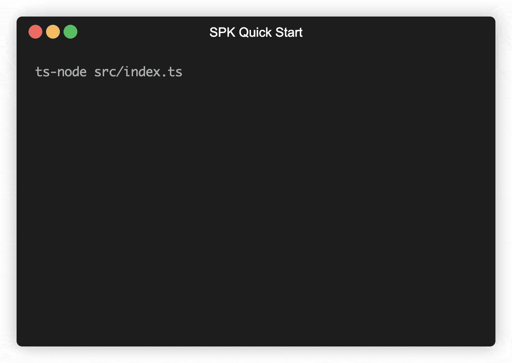

# Demonstration of "Quick Start" for SPK

## Problem

* When someone visits a GitHub project page they will want to get up and going extremely fast
* People don't read documentation
* Currently we have many entry points and don't do enough to guide users down a path
* Setting up SPK configuration is difficult
* Getting the big picture of what SPK offers takes time.

## What to accomplish in this prototype

* I want users to _get_ GitOps in less than 5 minutes.
* Develop a way to help users quickly and interactively build up their configuration  
* Supercharge our scaffolding by doing what we do in the integration tests
* Get people further down the line with SPK and Bedrock practices

## Current Requirements

Current this prototype assuming the repo for this project is a sibling to a the `spk` repo. The sibling `spk` must be named `spk`. See diagram below:

```bash
├── spk
│   ├── .git
│   ├── **
├── spk-demo (this repo)
│   ├── .git
│   ├── **
```

## What to expect



------

## Things that helped me

- https://github.com/microsoft/azure-devops-node-api (Azure Node API)
- https://www.typescriptlang.org/docs/handbook/react-&-webpack.html (Covers project layout)
- https://github.com/SBoudrias/Inquirer.js/tree/master/packages/inquirer/examples (Inqurier examples)
